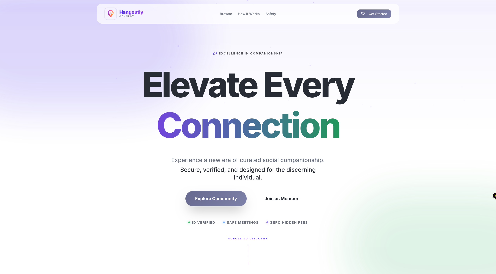

# ⚡️ Hangoutly

### 🚀 Secure, Verified & Immersive Companionship Marketplace

[](https://opensource.org/licenses/MIT)
[](https://reactjs.org/)
[](https://supabase.com/)
[](https://vercel.com/)

---

**Hangoutly is a secure marketplace for verified, time-based companionship.** We facilitate meaningful human connections by bridging the gap between individuals seeking social interaction and professional companions for activities like movies, hiking, dining, or attending events.

> [!Note]
> **✨ Imagine having a trusted companion for any social event without the complexity of traditional networking. Hangoutly provides the perfect ingredients to create genuine, safe, and mutually respectful connections in your city.**

---



> [!IMPORTANT]
> **Legal & Ethical Boundary**: Hangoutly is strictly a companionship platform. We sell *time*, not people. Any request or provision of unusual activity types or prohibited non-social conduct beyond agreed social activities, or "implicit expectations" is strictly prohibited and will result in an immediate permanent ban.

---

## 📖 Contents

- [Core Principles](#-core-principles)
- [Software Overview](#-software-overview)
- [Requirements](#-requirements)
- [Installation](#-installation)
- [Database Setup](#-database-setup)
- [Project Structure](#-project-structure)
- [License & IP](#-license--intellectual-property)

---

## 🛡️ Core Principles

**Hangoutly** is built on three pillars that ensure a professional and safe environment:
1. **Time, Not People**: We facilitate the booking of social time for specific, predefined activities.
2. **Safety First**: Manual admin verification of all participants (NID/Nagrita required).
3. **Privacy by Design**: Time-limited communication and data auto-deletion post-session.

---

## 👀 Software Overview 🎉

### 🛒 The Immersive Marketplace
* **Dual-Sided Experience**: Dedicated workflows for both *Companions* and *Regular Users*.
* **Immersive Discovery**: Full-viewport hero experience with glassmorphic UI and smooth GSAP animations.
* **Bento Grid Spotlights**: Dynamic member showcases with real-time status indicators.
* **Smart Search & Filters**: Discover companions by city, profession, or activity.

### 🛡️ Trust & Safety Suite
* **Identity Verification**: Real-world ID verification badges for authenticated trust.
* **Time-Limited Chat**: Auto-locking chat windows with a 30-minute buffer, ensuring privacy after meetups.
* **Consent Protocols**: Explicit rules enforced at every stage of the user journey.
* **Blocking & Favorites**: Instant security tools to manage your social network.

### 💳 Transactional Integrity
* **Localized QR Payments**: Manual P2P verification flow suited for regional banking and mobile wallets.
* **QR Request System**: Integrated billing requests for seamless, transparent payments.

---

## ⚙️ Requirements

* **Node.js**: 18.0.0 or newer 🚀
* **Database**: Supabase (PostgreSQL)
* **Storage**: Supabase Storage for identity and gallery assets.
* **Supabase CLI**: Required for local migration management.

---

## 🛠️ Installation

1. **Clone the repository**
   ```bash
   git clone https://github.com/your-username/hangoutly.git
   cd hangoutly
   ```

2. **Install dependencies**
   ```bash
   npm install
   ```

3. **Configure Environment**
   Create a `.env` file in the root:
   ```env
   VITE_SUPABASE_URL=your_project_url
   VITE_SUPABASE_ANON_KEY=your_anon_key
   ```

4. **Launch Development**
   ```bash
   npm run dev
   ```

---

## 🗄️ Database Setup

Hangoutly uses version-controlled migrations for maximum stability.

1. **Link Project**
   ```bash
   npx supabase link --project-ref your-project-ref
   ```

2. **Apply Schema**
   ```bash
   npx supabase db push
   ```

---

## 📂 Project Structure

```text
├── src/
│   ├── components/     # Atomic UI components
│   ├── hooks/          # Business logic (Companions, Chat, Bookings)
│   ├── integrations/   # Supabase client configuration
│   └── pages/          # Dashboards and Public Views
├── supabase/
│   └── migrations/     # Schema and RLS policies
└── public/             # Optimized assets
```

---

## 📄 License & Intellectual Property

### License
Licensed under the **MIT License**. You are free to copy, modify, and distribute the code for personal or commercial use.

### Intellectual Property
While the code is open, the **Hangoutly** brand, logo, and unique concept of the "Companionship Time Marketplace" are the intellectual property of the creators. All rights reserved regarding official branding.

---
Built with ❤️ for meaningful human connections.
